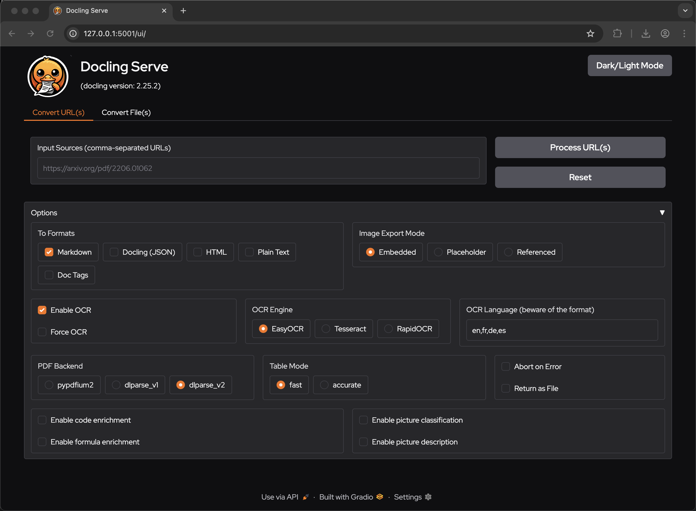
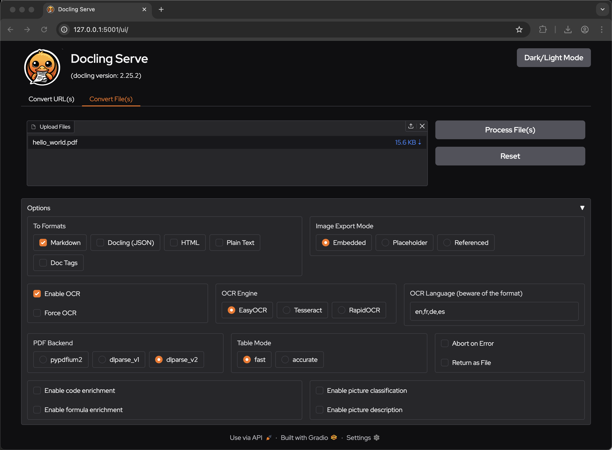
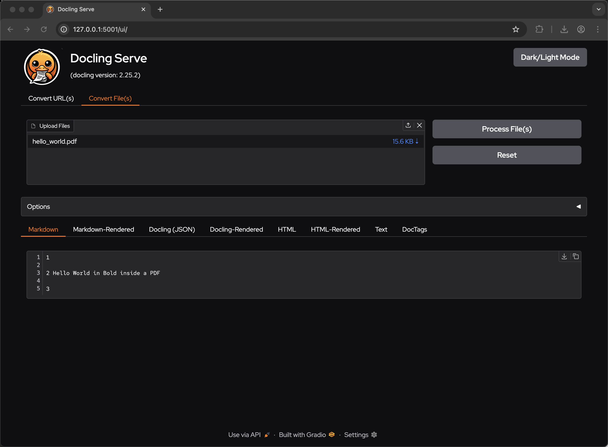

# Docling Tutorial


## Installation

```bash
python3.11 -m venv venv
source venv/bin/activate
```

To use Docling, simply install it using pip:

```bash
pip install docling
```

Docling works on macOS, Linux, and Windows environments, supporting both x86_64 and arm64 architectures.


## Usage Examples

This repository contains several examples of using Docling:

### 1. Python API Example

The `remote_pdf_example.py` script demonstrates how to use Docling's Python API to convert a PDF to markdown:

```bash
python remote_pdf_example.py
```

This will:
1. Download and process the PDF from the provided URL
2. Convert it to markdown
3. Save the output to `output.md`
4. Print a preview of the markdown content

### 2. Local PDF Example

The `local_pdf_example.py` script demonstrates how to use Docling with a local PDF file

```bash
python local_pdf_example.py sample-pdfs/hello_world.pdf
```

review local_output.md

```bash
python local_pdf_example.py sample-pdfs/Zippity_Zoo.pdf
```

review local_output.md

```bash
python local_pdf_example.py sample-pdfs/sales-summary.pdf
```


If no path is provided, it will look for a file named `sample.pdf` in the `sample-pdfs` directory.

### 3. CLI Example

Docling also provides a convenient command-line interface. 

```bash
# Basic usage
docling https://arxiv.org/pdf/2408.09869


# Using SmolDocling VLM (if available)
docling --pipeline vlm --vlm-model smoldocling https://arxiv.org/pdf/2408.09869 
```

#### docling cli examples

##### With output folder

```
mkdir -p output/zippity-zoo
docling ./sample-pdfs/Zippity_Zoo.pdf --output output/zippity-zoo/
```

##### Embedded chart

```
mkdir -p output/global_sales
docling ./sample-pdfs/Global_Sales_Performance_Overview_2024.pdf --image-export-mode referenced --output output/global_sales/
```


##### Embedded table

```
mkdir -p output/product_revenue
docling ./sample-pdfs/Product_Revenue_FY2024.pdf --image-export-mode referenced --output output/product_revenue/

mkdir -p output/weekly_time_sheet
docling ./sample-pdfs/Weekly_time_sheet.pdf --image-export-mode referenced --output output/weekly_time_sheet/

mkdir -p output/invoice_1
docling ./sample-pdfs/Invoice-1.pdf --image-export-mode referenced --output output/invoice_1/

```


##### Images and charts

```
mkdir -p output/census
docling https://www.census.gov/content/dam/Census/library/publications/2023/demo/p60-279.pdf --image-export-mode referenced --output output/census/

mkdir -p output/pew_ai_workers
docling https://www.pewresearch.org/wp-content/uploads/sites/20/2025/02/ST_2025.2.25_AI-Workers_REPORT.pdf --image-export-mode referenced --output output/pew_ai_workers/

mkdir -p output/pew_life_stages
docling https://www.pewresearch.org/wp-content/uploads/sites/20/2025/03/pg_2025.03.19_life-stages_report.pdf --image-export-mode referenced --output output/pew_life_stages

```

##### Contracts
```
mkdir -p output/new_hampshire_contract
docling https://www.das.nh.gov/purchasing/docs/Notice_Of_Contract_SIGNED/8002969%20Salesforce%20Professional%20Services%20rev.pdf --image-export-mode referenced --output output/new_hampshire_contract
```

```
mkdir -p output/vermont_contract
docling https://bgs.vermont.gov/sites/bgs/files/files/purchasing-contracting/C-two/38298%202-2.pdf --image-export-mode referenced --output output/vermont_contract
```

##### Survey Data

```
mkdir -p output/cncf_survey_24
docling https://www.cncf.io/wp-content/uploads/2025/04/cncf_annual_survey24_031225a.pdf --image-export-mode referenced --output output/cncf_survey_24
```


For Mac-users

```
pip install mlx-vlm
```

```
pip show docling
Name: docling
Version: 2.28.4
Summary: SDK and CLI for parsing PDF, DOCX, HTML, and more, to a unified document representation for powering downstream workflows such as gen AI applications.
Home-page: https://github.com/docling-project/docling
Author: Christoph Auer
Author-email: cau@zurich.ibm.com
License: MIT
Location: /Users/bsutter/ai-projects/docling-tutorial/venv/lib/python3.11/site-packages
Requires: beautifulsoup4, certifi, docling-core, docling-ibm-models, docling-parse, easyocr, filetype, huggingface_hub, lxml, marko, openpyxl, pandas, pillow, pluggy, pydantic, pydantic-settings, pylatexenc, pypdfium2, python-docx, python-pptx, requests, rtree, scipy, tqdm, typer
Required-by:
```

```
mkdir -p output/produce_revenue_vlm
docling --pipeline vlm --vlm-model smoldocling --output output/produce_revenue_vlm/ ./sample-pdfs/Product_Revenue_FY2024.pdf
```

For more details, check out the [advanced usage options](https://github.com/docling-project/docling) in the official documentation.


## Docling Server


### API Server

```
pip install docling-serve
```

```
export DOCLING_MODELS_DIR="/Users/bsutter/ai-projects/docling-tutorial/docling_models"
```

```
docling-serve run
```

```
open http://127.0.0.1:5001/docs
```

```
curl -X 'POST' \
  'http://localhost:5001/v1alpha/convert/source' \
  -H 'accept: application/json' \
  -H 'Content-Type: application/json' \
  -d '{
    "http_sources": [{"url": "https://arxiv.org/pdf/2501.17887"}]
  }'
```

### GUI

Stop the API server (control-c)

```
pip install "docling-serve[ui]"
```

```
docling-serve run --enable-ui
```

```
open http://127.0.0.1:5001/ui
```

And try some of the sample PDFs








## Resources

- [Docling GitHub Repository](https://github.com/docling-project/docling)
- [Detailed Installation Instructions](https://github.com/docling-project/docling)
- [SmolDocling](https://github.com/docling-project/docling) - Visual Language Model for document understanding


## Sources

[Time Sheet](https://docs.google.com/spreadsheets/d/1QJm5bwmGWfZnQW7SWPZwc_bTEVbEdG08t0QaWZ2XQlA/edit?usp=sharing)

[Product Revenue FY2024](https://docs.google.com/document/d/1du_ERpix9n_iGtor_fcUl1zXedIHmaAS8tPOoq502M0/edit?usp=sharing)

[Product Revenue Table](https://docs.google.com/spreadsheets/d/1iNPSSMumosHNzcAqJpA9xDqhQgiGjYUVczNVEOBQpzE/edit?usp=sharing)

[Global Sales](https://docs.google.com/document/d/19NVnuwdHQaU2QY3NcrEoLwFOQ0kn23cV6Xz6E5AuH4E/edit?usp=sharing)

[Invoice](https://docs.google.com/spreadsheets/d/1Xiqdg_ZlnHIcZOLyPwnyBlPrklx2g6oCPfKWmnkd1gs/edit?usp=sharing)


